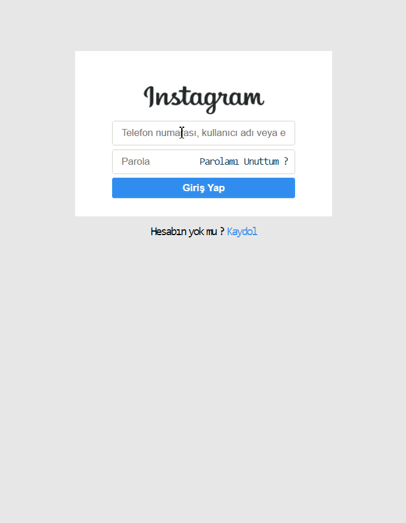
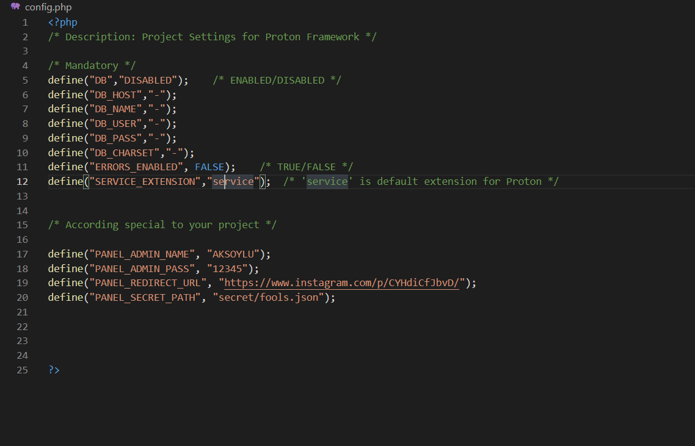

# WhiteHat Instagram Phishing Hack Tool

Working demo : [http://whitehat.aksoylu.space](http://whitehat.aksoylu.space)

**ATTENTION : THIS IS A WHITE HACK TOOL. NOT CREATED FOR HARMING NETWORK SECURITY. 
ONLY EDUCATION & RESEARCH PURPOSES ALLOWED**

## How to start up ?
I have created project in PHP, with using my own **PROTON** framework. So, we can think about that this is also an Proton Framework Demo.
You don't need to know extra server management for starting up InstaPhishing. Just copy the content of **src** folder to your htdocs or www folder (Maybe differ by your hosting)

## How to use ?
There is two different page in InstaPhishing. Main and Admin.
Main page is where our fools getting trapped . When they wrote their credentials for loggin in, InstaPhishing will catch their credentials and store in **secret/fools.json** file.

When you wrote your **admin** credentials for loggin in, InstaPhishing will recognize you and navigate your browser to **/admin** page.
In admin page, you can see user credentials that catched by InstaPhishing tool.

## Management

You can change your admin credentials in **config.php**. Also you can change navigation url when fools clicked login button. In the other hand, you are allowed to change credential storage path.